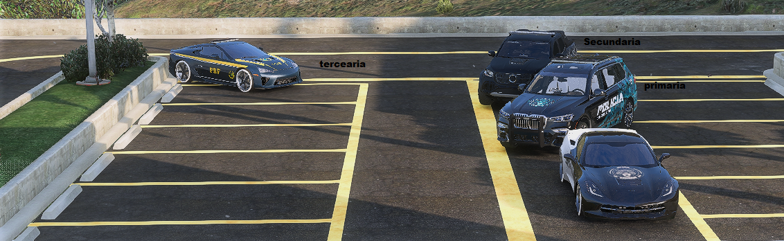
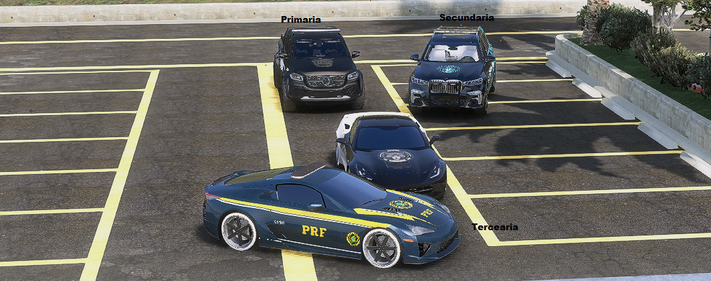

# 🔴Abordagem🔴

## Postura e Conduta 

É dever do oficial manter o controle em todas as circunstâncias. Por isso é fundamental que esteja com o emocional equilibrado durantes as patrulhas. Se não estiver bem, é recomendado sair de serviço até que se sinta apto novamente.

***

## Procedimento de Abordagem

Enquanto em serviço, todos os oficiais tem autoridade legal para realizarem abordagens de toda a natureza e intensidade a qualquer cidadão. Isso inclui verificação de documentação, abordagens de trânsito por infrações, ações de caráter instrutivo, entre outros.

<mark style="background-color:$info;">Lembrando que legalidade de revista não e a mesma coisa que legalidade de abordagem.</mark>

***

## Legalidade de Revista

O oficial tem direito a realizar revistas pessoais desde que exista uma justificativa plausível para o ato. Não é necessário aguardar uma denúncia pela central para poder agir.

<mark style="color:blue;">Fundada Suspeita</mark>

Utilizada dentro de um raio de 1KM da QRU. Deve-se avaliar a variante de tempo e deslocamento do mesmo.

<mark style="color:blue;">Denuncia por caracteristica</mark>

Denuncia feita por um boletim de ocorrencia (B.O) ou uma denuncia pelo PD informando principais caracteristica do mesmo e veiculo ( modelo, coloração entre outros ). Se durante patrulha observar alguém que bata com a denúncia, poderá ser abordado e deverá ser revistado.

<mark style="color:blue;">Flagrante</mark>

Aonde o mesmo foi pego no ato, não há contestação para a revista

<mark style="color:blue;">Mascara e equipamentos restritos</mark>

Indivíduo que esteja utilizando máscara, coldre e/ou colete balístico será solicitado a retirada. Se não acatar, será algemado pelo crime de **uso de equipamento restrito** e/ou **ocultação facial**, resultando na revista pessoal.

***

## Revista pessoal em feminina

Permanecendo as legalidade de revista nessa situação, a feminina não poderá ser tocada por nenhum oficial do sexo masculino. Uma PFEM ( Policial feminina ) deverá ser solicitada no local da ocorrência para que possa ser realizado o procedimento correto e legal.

* "QAP Central, PFEM Em QRV?"
* "Preciso que venha ate meu QTH para fazer uma revista em uma feminina, por gentileza."


Caso não tenha PFEM em QRV ou em serviço, o oficial presente deverá oferecer o procedimento da caixa.


<figure><figcaption></figcaption></figure>

<mark style="color:yellow;">F8: /e caixa e depois utilizar o Revistar</mark>


O procedimento deve ser realizado nas celas do Departamento de Polícia e precisa ser registrado em vídeo para evitar qualquer situação de constrangimento no futuro. Deixe claro que a revista é na caixa e não na feminina.


## Revista Veicular

<mark style="color:blue;">Porta Luvas</mark>

Toda QRU de código 2+ onde o indivíduo foi revistado, seu veículo também deverá passar por inspeção (Apenas porta-luvas).

<mark style="color:blue;">Portas Malas</mark>

Verificado em situações de tráfico de entorpecentes onde o indivíduo foi pego em flagrante ou o teste residual deu positivo.

Situações de código 5 ou prioridade onde o indivíduo foi pego em flagrante ou o teste residual de pólvora deu positivo.


Se o indivíduo for pego mexendo no porta-malas durante acompanhamento ou abordagem, independente de não ser o dono do veiculo, deve-se realizar a revista.


## Teste Residual/pólvora

Durante abordagem pode ser que seja necessário utilizar o teste residual ou o teste de polvora

<mark style="color:blue;">Teste residual</mark>

* Flagrante: Não há a necessidade de testes, a revista é permitida.
* Teste positivo: Será revistado e conduzido.
* Teste negativo: Será liberado.


Não fiquem apreensivos em liberar um indivíduo se a história dele for convincente.


<mark style="color:blue;">Teste de pólvora</mark>

* Suspeito: Caso o mesmo esteja no local do COD 5 ou passando muitas vezes na região
* Teste positivo: Será revistado e conduzido.
* Teste negativo: Será liberado.

## Apreensão de itens

<mark style="color:blue;">Apreensão liberada</mark>

* [x] Caso a QRU ja esteja finalizada ( COD.4 ) e o mesmo esteja na prisão.
* [x] Caso ocorra uma QRU de COD.5 ( Prioridade ) e os mesmo seja abatidos.


Lembrando que, só esta permitido a apreensão dos itens depois da <mark style="color:red;">área vermelha</mark> acabar e o anuncio de ação finalizada ser lançado.


<mark style="color:blue;">Apreensão não liberada</mark>

* [x] Caso a QRU esteja em andamento <mark style="color:red;">não esta liberado</mark> a apreensão dos itens do mesmo.
* [x] Caso uma ação fechada ou prioridade esteja em andamento é <mark style="color:red;">totalmente proibido</mark> fazer a apreensão.


Lembrando que a utilização do /REVISTAR é totalmente proibida nos corpos.


## Abordagens

<mark style="color:blue;">Abordagem de nivel 1</mark>

Destinada às situações de trânsito, o objetivo principal é a verificação de documentos e pendências em nome do indivíduo. Aplicando as advertências cabíveis se for necessário.

* P1 faz uso do luminoso e sonoro dando a ordem de parada.
* O P2 solicitará apoio de mais duas unidades e assim que chegarem será iniciada a abordagem. \
  <mark style="color:$warning;">"QAP Central, Iniciando uma abordagem de CODIGO 1 em um S15 Branco tripulado x2 na região do vermelho, preciso de apoio de mais 2 unidades. Alguma unidade pra prestar apoio?"</mark>

<figure><figcaption></figcaption></figure>

*   Com o apoio já no local, o P2 irá até o veículo abordado e se apresentará formalmente ao indivíduo explicando o motivo da abordagem.

    "Bom dia, sou o Coronel Dybala Maledict do 1° BPM-Garden. Parei o senhor porque foi observado que os faróis traseiros do seu veículo estão quebrados."

    * Após contextualização, será solicitado o documento do envolvido presente e será feita a checagem de pendências.


Se houver alguma pendência, será solicitado o pagamento imediato ou um prazo aplicado para a regularização. Se estiver procurado, será conduzido ao Departamento de Polícia para esclarecimentos. Se o veículo for roubado também será conduzido.



Se tudo estiver nos conformes e o veículo em dia, será aplicada a advertência verbal com multa (Opcional) e o abordado liberado após o giroflex ser desligado.


<mark style="color:blue;">Abordagem de nivel 2</mark>

Mais comum no dia-a-dia dos oficiais, são destinadas às QRU's de corrida ilegal, tráfico de entorpecentes, roubo de veículo, uso de equipamentos restritos, entre outros.

* P1 faz uso do luminoso e sonoro dando a ordem de parada.
* O P2 solicitará apoio de mais duas unidades e assim que chegarem será iniciada a abordagem. solicitará o desembarque do abordado de seu veículo, encostando na parede com as mãos para trás.\
  <mark style="color:$warning;">"QAP Central, Iniciando uma abordagem de CODIGO 2 em um R34 Vermelho tripulado x1 na região do SAMIR, preciso de apoio de mais 2 unidades. Alguma unidade pra prestar apoio?"</mark>

<figure><figcaption></figcaption></figure>

*   Com o apoio já no local, o P2 irá até o indivíduo se apresentar formalmente e explicar o motivo da abordagem.

    <mark style="color:$warning;">"Bom dia, sou o Coronel Dybala Maledict do 1° BPM-Garden. Parei o senhor porque recebemos denúncia de um roubo de Veiculo no local."</mark>
* Após contextualização, será solicitado o documento do envolvido presente e será feita a checagem de pendências juntamente com o procedimento padrão de revista (Se a história não for convincente).


Se for liberado, o indivíduo deverá ligar seu carro e partir após o giroflex ser desligado.



Se for conduzido para o Departamento de Polícia, deve-se dar o código 4 na rádio assim que concluírem a abordagem.


<mark style="color:blue;">Abordagem de nivel 3</mark>

Destinada às QRU's de disparos, visual armado, sequestro e afins. O padrão de unidades participantes são 03 Unidades, porém pode aumentar se um Sargento+ ou BOPE/CORE sentir a necessidade. O posicionamento segue o padrão abaixo. No momento em que o indivíduo descer do veículo, a primária deverá se aproximar e algemá-lo de imediato para garantir a segurança de todos.

<figure><figcaption></figcaption></figure>

## Lei de miranda


_"Você tem o direito de permanecer em silêncio. Tudo o que você disser pode e será usado contra você em um tribunal. Você tem direito a um advogado. Se não puder pagar um advogado, um será providenciado. Você compreende os direitos que acabei de ler para você?"_

