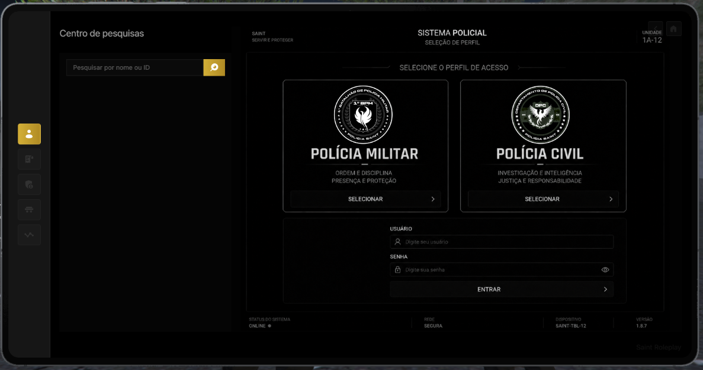
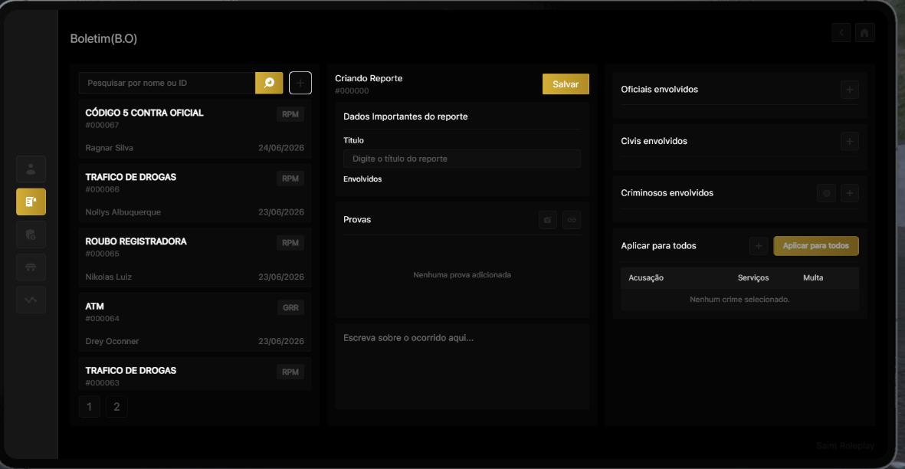
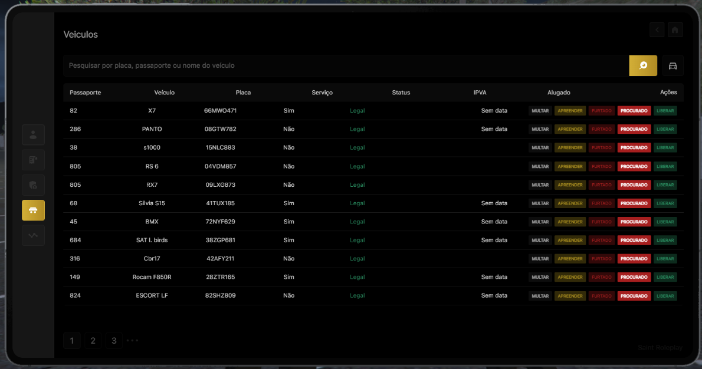
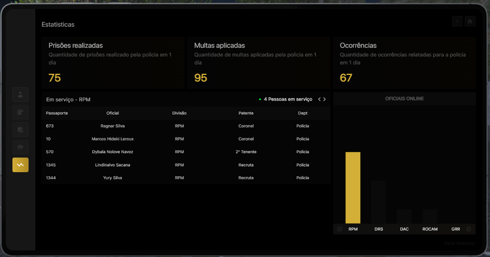

# 🟡Prisional🟡

Esse guia serve para melhor explicação das suas funcionalidades e eventuais retiradas de dúvidas.

## Painel

para acessar o sistema da policia e necessario o Tablet Policial | TabletSaint.

<figure><figcaption></figcaption></figure>

Nessa primeira parte temos o **Centro de pesquisas,** Nela você consegue pesquisar o historico de algum OFICIAL ou CIVIL.

***

## Boletim De Ocorrência e Prisão

<figure><figcaption></figcaption></figure>

A aba de BOLETIM (B.O) é a segunda opção no tablet, sendo um lugar aonde poderá ver e fazer as prisões.

Ao capturar um meliante é necessario conduzi-lo para a DP-S para realizar os procedimentos: 

* Conduzir o mesmo ate a área das celas, Aonde existe duas(2) salas para realizar as fotografias dos mesmo.
* Basta Utilizar o ( + ) para criar um B.O, logo em seguida vai aparecer uma nova janela com as informações: Titulo, Provas, Oficiais, Civis e Criminosos envolvidos.


O indivíduo deve estar **algemado com os braços para trás** e **não deve estar usando qualquer tipo de adorno** (chapéus, bonés, toucas, óculos e outros itens que dificultem a identificação);


* Assim que tirar a foto do meliante, levamos o mesmo para as celas aonde iremos fazer o procedimento de revista. Aonde somente os itens ILEGAIS serão apreendidos.


A Revista em **MOCHILAS** só é permitida com a permissão do dono da mesma.


* Na criação do B.O é importante colocar a QRU principal no titulo ( **atm, corrida, trafico...** ). Sobre na parte de ( Escreva sobre o ocorrido ) iremos utilizar da seguinte maneira:

\
1° Batalhão De Policia Militar Saint.

Recebemos uma denuncia de ( QRU ) na região do ( QTH ), Chegando no local foi avistado um ( Veiculo ) Tripulado ( 2X ), Tentamos fazer abordagem no mesmo porem o mesmo se negou a parada, assim iniciando um acompanhamento contra o mesmo. aonde o veiculo do mesmo fico inoperante na região do ( QTH ). COD 4

Veiculo/Placa:
\
Itens Apreendidos:

***

* <mark style="color:$warning;">Oficiais Envolvidos</mark> - Sera os oficiais que estão na QRU, normalmente sempre terá o QRA da primaria
* <mark style="color:$warning;">Civil Envolvidos</mark> - Sempre e somente utilizado caso um civil queira fazer uma denuncia ( Veiculo roubado, Tentativa de sequestro etc...
* <mark style="color:$warning;">Criminosos Envolvidos</mark> - Utilizado apenas para os meliantes envolvido na QRU.

***

<table><thead><tr><th align="center">REDUÇÃO</th><th align="center">PORCENTAGEM</th><th align="center" valign="middle">SITUAÇÃO</th></tr></thead><tbody><tr><td align="center">Réu Primário S/Advogado</td><td align="center">10 a 30%</td><td align="center" valign="middle">Réu primário é aquele que, no momento da prisão, não possui registro penal.</td></tr><tr><td align="center">Réu Primário C/Advogado</td><td align="center">10 a 50%</td><td align="center" valign="middle">De acordo com a negociação entre o policial e o advogado.</td></tr><tr><td align="center">Bom comportamento</td><td align="center">10%</td><td align="center" valign="middle">Caso o individuo coopere com no momento da prisão.</td></tr><tr><td align="center">Presença de Advogado</td><td align="center">20 a 30%</td><td align="center" valign="middle">De acordo com a negociação com advogado.</td></tr><tr><td align="center">Delação Premiada</td><td align="center">50%</td><td align="center" valign="middle">Participação útil em investigações</td></tr></tbody></table>


o indivíduo poderá receber benefícios que reduzem seu tempo de prisão. Essas reduções se aplicam apenas à pena, **não sendo permitido reduzir o valor das multas.**


***

## Veiculos

<figure><figcaption></figcaption></figure>

Nessa parte teremos todas as informações de todos os veiculos da cidade, assim podendo **Multar, Apreender, colocar como furtado, procurado e liberar veiculo.**

***

## Estatisticas

<figure><figcaption></figcaption></figure>

Aqui você podera ver os oficiais que estão de serviço e seus grupamentos.
